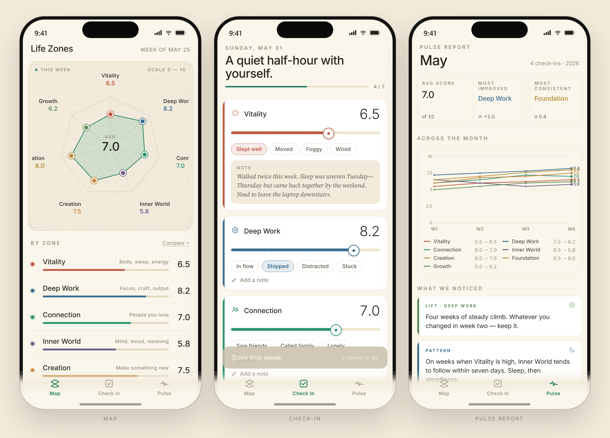
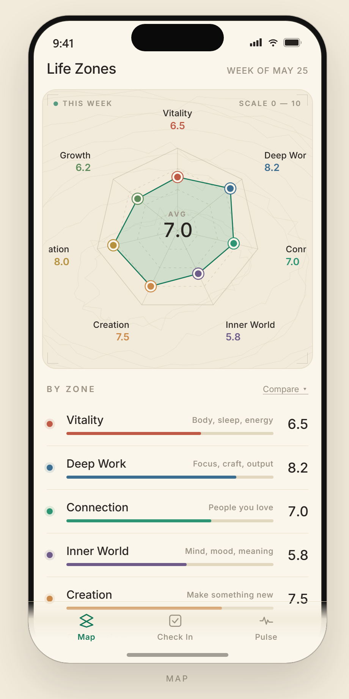
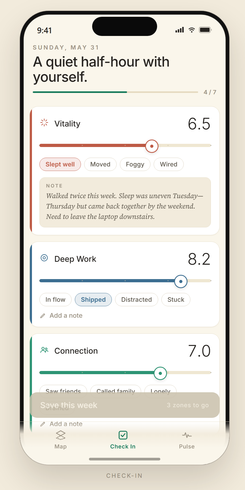
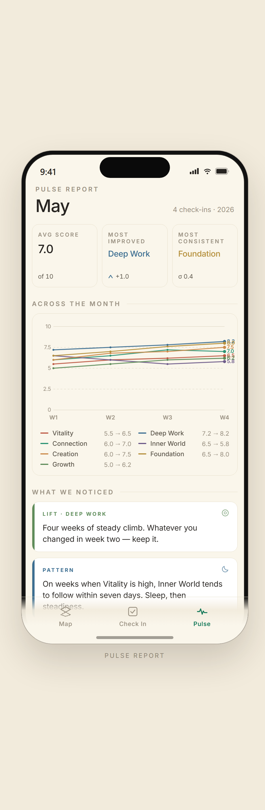
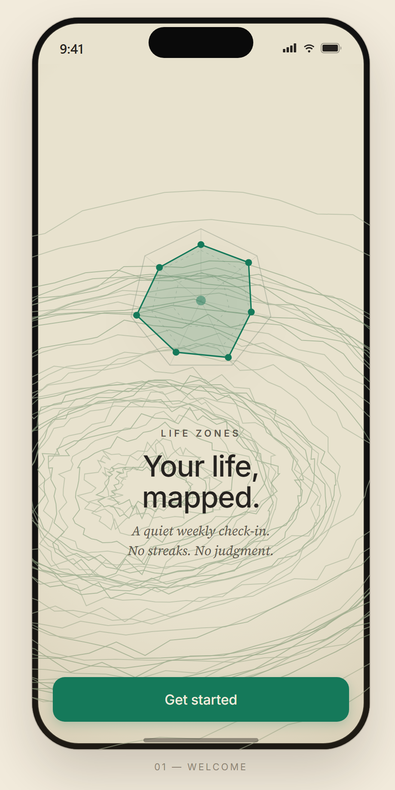
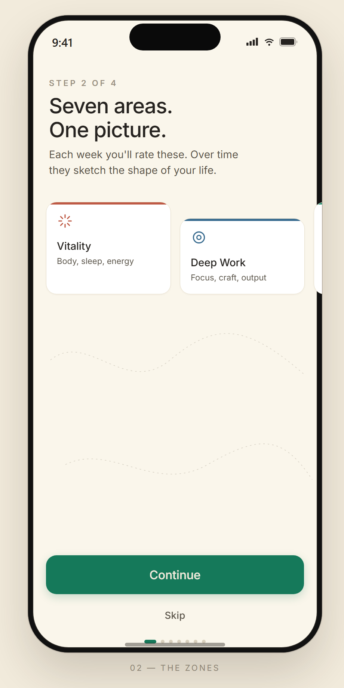
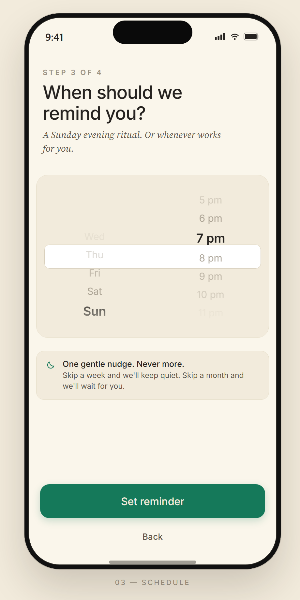
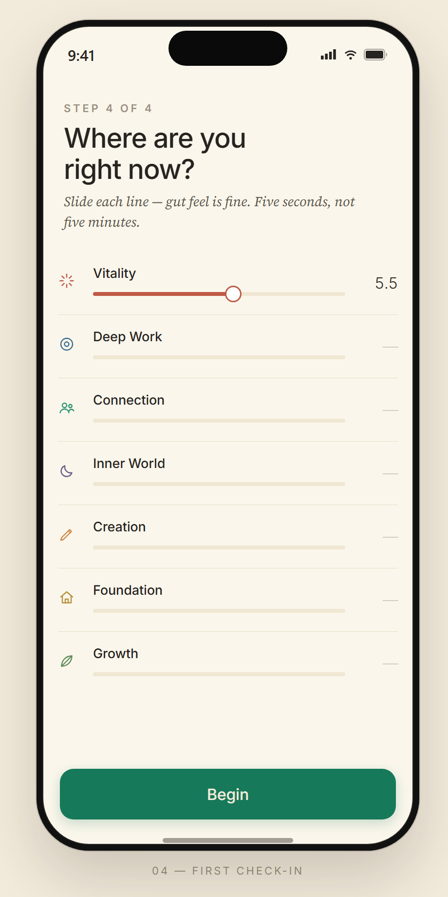
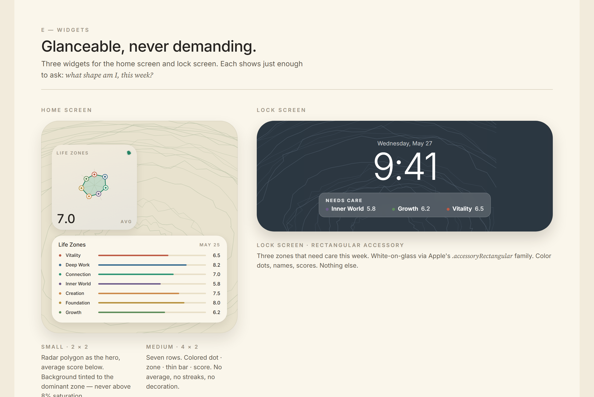
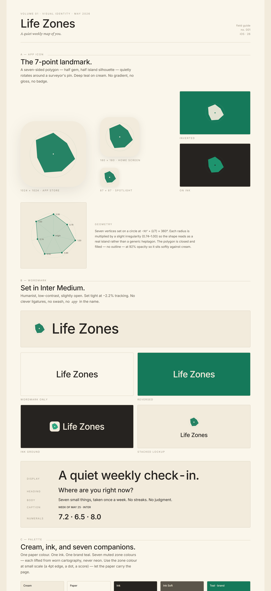

# Life Zones Map

A weekly self-reflection iOS app that visualizes life balance as an interactive island map, detects patterns across zones, and surfaces personal insights over time.



## Design

The visual identity, palette, and screen design come from a Claude Design handoff (`design/life-zones/`). The Swift code reimplements each screen pixel-by-pixel in SwiftUI + Canvas.

### The three tabs

| Map | Check-In | Pulse |
|:---:|:---:|:---:|
|  |  |  |
| 7-zone radar, corner ticks, center avg badge, topo backdrop | Custom slider with tick marks, tag pills, serif-italic notes | Stat cards, line chart, insight feed, connection web |

### Onboarding — 4 screens

| Welcome | Zones | Schedule | First check-in |
|:---:|:---:|:---:|:---:|
|  |  |  |  |

### Widgets



Small (radar + avg), medium (7-zone bars), lock-screen rectangular ("Needs care").

### Visual identity



App icon (7-point polygon), Inter Medium wordmark, cream + ink + 7 muted earthy zone colors.

---

## Overview

Life Zones Map lets you check in once a week on 7 life zones — each rated 1–10. The map updates visually as scores change. After 3+ weeks, the app surfaces correlations, trends, and patterns. No streaks, no gamification, fully private by default.

### The 7 Zones

| Zone | Focus |
|---|---|
| **Vitality** | Energy, body, health |
| **Deep Work** | Focus, productivity, craft |
| **Connection** | Relationships, belonging |
| **Inner World** | Emotions, clarity, peace |
| **Creation** | Making, expression, play |
| **Foundation** | Stability, finances, routines |
| **Growth** | Learning, purpose, direction |

## Tech Stack

- **Swift 6 / SwiftUI** — iOS 17+
- **SwiftData** — on-device persistence
- **Swift Charts** — trend visualization
- **Canvas API** — custom radar map rendering
- **WidgetKit** — home screen zone snapshot
- **UserNotifications** — weekly check-in prompt
- **CoreHaptics** — slider feedback
- **Anthropic API** *(opt-in)* — richer pattern insights

## Project Structure

```
LifeZonesMap/
├── App/                    ← Entry point, TabView host
├── Models/                 ← SwiftData models, ZoneDefinition, ZoneRegistry, DesignSystem
├── Services/               ← CheckInService, PatternEngine, NotificationScheduler, ExportService
├── ViewModels/             ← @Observable VMs for Map, CheckIn, Pulse tabs
├── Views/
│   ├── Map/                ← Radar canvas, ZoneDetailSheet, history chart
│   ├── CheckIn/            ← Zone card flow, summary
│   ├── Pulse/              ← Monthly summary, trend chart, insight feed, connection web
│   ├── Onboarding/         ← 4-screen intro flow
│   └── Settings/           ← Schedule, export, zone names, API key
├── Resources/              ← Assets.xcassets
LifeZonesWidget/            ← WidgetKit extension (small/medium/lock screen)
LifeZonesMapTests/          ← Swift Testing unit tests (PatternEngine)
```

## Getting Started

### Prerequisites

- macOS 14+ with Xcode 15+
- iOS 17+ device or simulator

### Xcode Setup

1. Open Xcode → **File → New → Project** → App
2. Set:
   - **Product Name:** LifeZonesMap
   - **Team:** your team
   - **Bundle ID:** com.yourteam.lifezonesmap
   - **Interface:** SwiftUI
   - **Language:** Swift
   - **Storage:** SwiftData
3. Delete the auto-generated files (`ContentView.swift`, `Item.swift`)
4. **File → Add Files to "LifeZonesMap"** → select all folders from this repo's `LifeZonesMap/` directory
5. Add a new **Widget Extension** target named `LifeZonesWidget`
6. Add the `LifeZonesWidget/` files to that target
7. Configure an **App Group** (`group.com.yourteam.lifezonesmap`) for both targets in Signing & Capabilities

### App Group Setup

In `WidgetDataProvider.swift` and `LifeZonesWidget.swift`, replace `group.com.yourteam.lifezonesmap` with your actual App Group identifier.

### Anthropic API (optional)

Users can opt in under Settings → Insights → AI Insights. The API key is stored in `UserPreferences` (never leaves the device except when making API calls).

## Architecture

```
MVVM + Services
Views ↔ @Observable ViewModels ↔ Services ↔ SwiftData
```

- **`@Observable`** (iOS 17 Observation framework) replaces `ObservableObject`
- **`PatternEngine`** runs synchronously on small datasets; no async overhead needed
- **`CheckInService`** enforces one check-in per ISO week (Mon–Sun)
- **Widget** reads from shared `UserDefaults` App Group, refreshes daily + after each check-in

## Intelligence Layer

### Local (always on)

`PatternEngine` runs four algorithms after every check-in:

| Algorithm | Trigger | Output |
|---|---|---|
| Pearson correlation | `\|r\| > 0.65`, N ≥ 4 weeks | Zone pair insight |
| Linear trend | slope ≥ 0.8 or ≤ −0.8, last 4 weeks | Rising / declining warning |
| Drain detection | zone ≥ 8 while other drops ≥ 2, repeated | Energy-drain insight |
| Recovery | 5+ zones below 5 | Recalibration prompt |

### API (opt-in)

One call per month after 4+ check-ins. Sends only zone scores (no notes, no tags) to the Anthropic API. Results cached as `ZoneInsight` with `source: .api`.

## Design System

Colors, spacing, radii, and animation presets live in `DS` enum inside `ZoneRegistry.swift`.

| Token | Value |
|---|---|
| Accent | `#1D9E75` (teal) |
| Vitality | `#E24B4A` |
| Deep Work | `#378ADD` |
| Connection | `#1D9E75` |
| Inner World | `#7F77DD` |
| Creation | `#D85A30` |
| Foundation | `#BA7517` |
| Growth | `#639922` |

## Milestones

| # | Milestone | Est. effort |
|---|---|---|
| 1 | Project scaffold + data models | 2h |
| 2 | Map canvas rendering | 4h |
| 3 | Check-in flow | 3h |
| 4 | Persistence + CheckInService wiring | 2h |
| 5 | PatternEngine + tests | 4h |
| 6 | Pulse view + charts | 3h |
| 7 | Notifications | 1h |
| 8 | Onboarding | 2h |
| 9 | Settings + export | 2h |
| 10 | Widget | 3h |
| 11 | Polish + TestFlight | 4h |

**Total: ~30h**

## License

MIT
